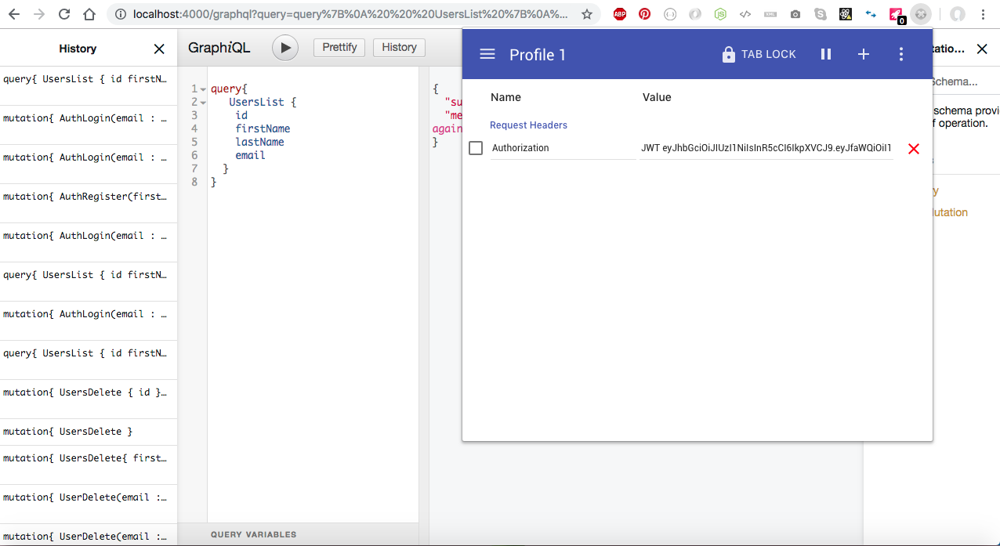

# graphql-server template

**Technologies :**
*nodejs*
*express* 
*graphql*
*mongoose*

**Guidelines :**

1. install dependencies : 

```js
npm install graphql express express-graphql --save
```

2. configure lint :
```js
npm install eslint --save-dev
./node_modules/.bin/eslint --init
```

3. add a /server/server.js file
in this file we will configure our gql server.
we start by configure a simple express server

```js
//express config 
const express = require('express')
const expressGraphQL = require('express-graphql')

// Create an express instance
const app = express()

// Connect with graphql and the graphiql panel
const gqlPath = process.env.GRAPHQL_APP_PATH || '/graphql'
console.log('gqlPath : ', gqlPath)
app.use(gqlPath, expressGraphQL({
  graphiql: true
}))

// Start server
const portNumber = process.env.GRAPHQL_APP_PORT || 4000
console.log('portNumber : ', portNumber)
app.listen(portNumber, () => {
  console.log('Server is running...')
})
```

4. configure dotenv :
```js
npm install dotenv --save
```

in index.js file and before any load :

```js
//dot env configuration
var dotenv = require('dotenv')
dotenv.load()
console.log('Your environment variable GRAPHQL_APP_PATH has the value: ', process.env.GRAPHQL_APP_PATH)

//launch server after loading env var
require('./server/server.js')
```
5. add cors, mongoose and bluebird
```js
npm install cors mongoose bluebird --save
```

6. add models folder which will contains all mongoose schema.
7. add graphql folder which will contains all gql schema & CRUD.
8. all models defined on models are exported on a single module inside index.js.
9. all schem & CRUD defined on graphql are exported on a single module inside index.js.
10. Define all constant inside .env file.
11. add babel to run ES6
```js
npm install --save-dev babel-cli
npm install --save-dev babel-preset-es2015
npm install --save-dev babel-preset-stage-0
```
12. add  .babelrc
```js
{
  "presets": ["es2015", "stage-0"]
}
```
13. modify package.json to run with babel
14. add nodemon so that it will automatically reload the app on everychange
```js
npm install --save-dev nodemon
```
https://javierfernandes.gitbooks.io/rest-api-babel-express/content/nodeapp.html

15. mongo database preparation :
https://docs.mongodb.com/manual/tutorial/install-mongodb-on-os-x/
https://stackoverflow.com/questions/2518127/how-do-i-reload-bashrc-without-logging-out-and-back-in

16. install Robomongo
17. customize logger file
```js
npm install morgan winston winston-daily-rotate-file --save
```
18. Test express default route - create a route file : AppRouter.js.
19. Test express default route - modify server.js :
```js
//routes
app.use('/users', AppRouter) 
app.use('/photos', AppRouter)

//route index
app.get('/', (req, res) => {
  res.send('Invalid endpoint!')
})
```
20. prepare graphql types
21. link mongoose schema to graphql types and mongoose models using queries and mutation.
22. modify server.js for gql endpoint :
```js
import gqlProvider from '../grapql'
app.use('/graphql', cors(), expressGraphQL({
  schema: gqlProvider,
  rootValue: global,
  graphiql: true
}))
```
A single endpoint, every things is handled internaly inside gql : queries and mutations !

23. I found an issue firstly when calling find, I got an empty result.
I resolved this by adding collection name on mongoose models :
```js
let userSchema = mongoose.Schema(
  {
    firstName: String,
    lastName: String,
    birthday: String,
    job: String,
  },
  {
    collection: 'User'
  })
```
```js
let photoSchema = mongoose.Schema(
  {
    url: String,
    description: String,
    date: String,
  },
  {
    collection: 'Photo'
  })
```
24. Results :


25. queries & mutations :
/graphq/users/mutations
/graphq/users/queries

26. authentication :
yarn add jsonwebtoken passport passport-local-mongoose bcrypt passport-jwt

27. Passport strategy configuration : 
/passport/passport.js
```js
let opts = {}
opts.jwtFromRequest = ExtractJWT.fromAuthHeaderWithScheme(process.env.JWT_SCHEME)
opts.secretOrKey = process.env.JWT_SECRET_OR_KEY
const passeportJWTStrategy = new JWTStrategy(opts, function (jwt_payload, done) {
  const email = jwt_payload.email
  User.findOne({ email: email }, (error, user) => {
    if (error) {
      return done(error, false)
    } else {
      if (user) {
        done(null, user)
      } else {
        done(null, false)
      }
    }
  })
})
```

28. Passport MiddleWare :
/passport/passportMiddleWare
```js
const passportMiddleware = express()
passportMiddleware.use(passport.initialize())
passportMiddleware.use(passport.session())
```

29. Configure our server to use passport middleware :
```js
import passportMiddleware from '../passport/passportMiddleware'

// init and configure passport
app.use(passportMiddleware)
```

30. graphql middleware : context to handle authorization (required token)
/graphql/middleware/gqlMiddleware.js
```js
// passport proxy
    passport.authenticate(process.env.JWT_SCHEME, { session: false }, (error, user) => {

      // get request payload
      const body = req.body ? req.body.query : ''

      // if is login or register skip token auth
      if (body && (body.includes('AuthLogin') || body.includes('AuthRegister'))) {
        next()
        return
      }

      // need auth for others endpoint
      const token = AuthUtils.retrieveToken(req.headers)
      if (AuthUtils.isValidToken(token)) {
        // valid token
        next(user)
```

31. Configure server to use gqlMiddleware :
```js
import gqlMiddleware from '../grapql/middleware/gqlMiddleware'

// use graphql middleware
app.use('/graphql', gqlMiddleware)
```

32. Change queries & mutations :
```js
// Query
export default {
  type: new GraphQLList(User),
  resolve: (_, args, context) => {

    // user authorization 
    if (!context.user) {
      throw new Error(Messages.KEYS.WRONG_SESSION)
    }

    // users
    const users = AppModels.UserModel.find().exec()
    if (!users) {
      throw new Error(Messages.KEYS.USER_LIST_ERROR)
    }
    return users
  }
}
```

```js
//delete
const UserDelete = {
  type: User,
  args: {
    email: {
      type: new GraphQLNonNull(GraphQLString),
    }
  },
  resolve: (_, params, context) => {
    return new Promise((resolve, reject) => {

      // user authorization 
      if (!context.user) {
        reject(Messages.KEYS.WRONG_SESSION)
      }
```

33. Results :


 


